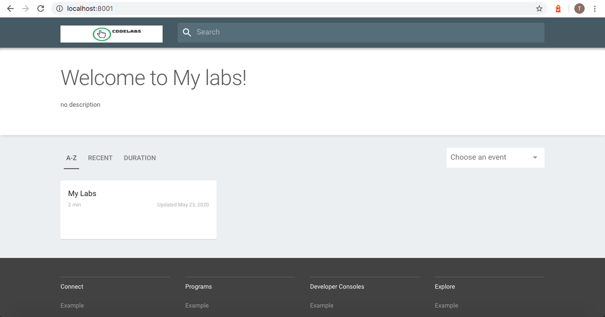
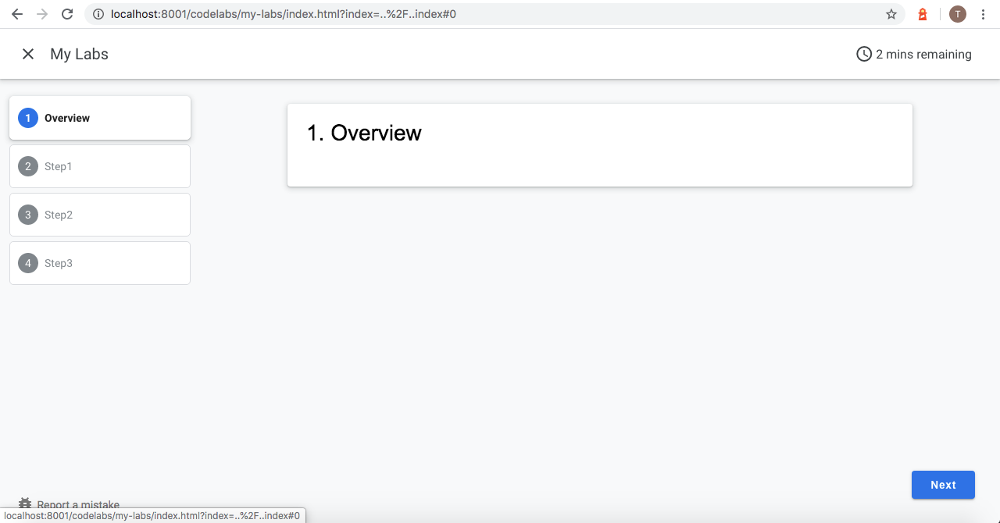

# **Dockerize Codelab**

Wrapping Codelab with Docker

## **Requirements**

 - Docker deamon

## **Usage**

### Start service with

#### Owner container

Start service with container

```bash
# Run from my container
$ docker run -d \
-p 8001:8000 \
--expose=8001 \
--name="codelab" \
patharanor/dockerize-codelab:1.0.2
```

#### Your container
Git clone/pull this repository to your workspace and then add your markdown into `./tools/site/codelabs/`.

example markdown [here](./tools/site/codelabs/my-labs.md)

After that run Docker build:
```bash
$ docker build -t mycodelab:0.0.1 .
```

Then serve it

```bash
$ docker run -d \
-p 8001:8000 \
--expose=8001 \
--name="codelab" \
mycodelab:0.0.1
```

### Add more labs

access to the container to append your markdown into `./tools/site/codelabs/`, then exit and restart the container :
```bash
# Accessing
$ docker exec -it YOUR_CONTAINER_ID /bin/sh
# Create markdown here
$ cd ./tools/site/codelabs
# Compile markdown with Claat
$ sh export.sh
# Exit container and restart after modified
$ docker restart codelab
```

you should see `My Labs`



this is my lab content



enjoy via
```bash
http://localhost:8001
```

## FAQ

### Issue

 - ENOSPC: System limit for number of file watchers reached
 [`Resolved`] https://github.com/guard/listen/wiki/Increasing-the-amount-of-inotify-watchers#the-technical-details

## License
MIT